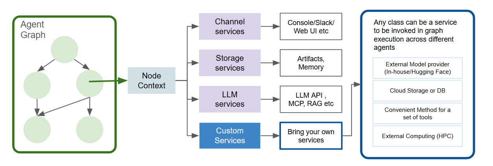

# AetherGraph — Key Concepts Overview

AetherGraph rethinks how agentic systems are built: **graphs are agents**, **context is the runtime fabric**, and **execution is event‑driven**. This document lays out the philosophy and the essential architecture so you can quickly reason about how it differs from typical frameworks—and how to use it effectively.

---

## 1. Introduction: Graphs + Context



AetherGraph departs from most agent frameworks in two fundamental ways:

1. **Every agent is a graph.** You model behavior as a directed acyclic graph (DAG) with nodes that can expand dynamically (reactive) or be planned statically.
2. **Every node runs inside a `NodeContext`.** The context is your per‑node control plane that exposes rich, injectable services.

**NodeContext services** include (built‑ins plus anything you add):

* **Channels** (Slack, Console/Web, …) for I/O and interaction
* **Artifacts** (blob store) for large files and generated assets
* **Memory** (history + summaries + optional RAG)
* **KV & Logger** for quick state and observability
* **LLM / MCP / RAG** bridges for model calls and tool use
* **Your custom services** registered at runtime

The system is **pythonic**, **reactive**, and **extensible**: author graphs directly in Python, then let context services handle communication, persistence, and orchestration details.

---

## 2. Graphs as Agents

AetherGraph unifies two modes under one mental model:

### Reactive agent — `@graph_fn`

* Executes immediately when called (behaves like an async Python function).
* Expands into an implicit DAG as tools run.
* Perfect for interactive, service‑rich, or conversational workflows.

### Static agent — `@graphify`

* First builds a concrete `TaskGraph`, then executes it via the scheduler.
* Ideal for stable, deterministic, or large‑scale workflows.

> **One model, two tempos.** Iterate fast with `@graph_fn`; snap to repeatable DAGs with `@graphify`.

---

## 3. Context as the Runtime Fabric

Every node (and each `graph_fn` invocation) receives a **NodeContext**. Think of it as a scoped service locator with lifecycle hooks.

* **Per‑node scoping** → independent logging, persistence, messaging.
* **Injectable services** → bind built‑ins or your own with simple registration.
* **Sidecar‑friendly** → channel adapters and stores can run out‑of‑process.

**Common patterns**:

* `context.channel().ask_text()` to collect input from a user/UI.
* `context.artifacts().save(...)` to persist files and structured outputs.
* `context.memory().record(...)` to capture provenance and summaries.
* `context.llm().chat(...)` to call your configured model provider.

---

## 4. Event‑Driven Execution & Waits

AetherGraph is event‑driven (not polling). Nodes suspend when waiting for input or an external event; the runtime persists and resumes continuations on demand so suspended nodes consume little to no CPU/RAM. Two primary wait styles are exposed:

- **Cooperative waits** — inline `await` for short, interactive flows where the coroutine remains in memory for low‑latency response.
- **Dual‑stage waits** — split a node into setup and resume phases; the continuation is durably stored so the process can free resources until an event triggers resume.

| Mode                   | Description                                                                            | CPU/RAM          | Ideal for                                  |
| ---------------------- | -------------------------------------------------------------------------------------- | ---------------- | ------------------------------------------ |
| **Cooperative waits**  | Inline `await` (e.g., `await context.channel().ask_text()`); coroutine stays in memory | Minimal          | Small reactive loops, interactive sessions |
| **Dual‑stage waits**   | Split node into setup/resume; continuation stored in a durable store                   | Zero when paused | Large DAGs, long‑lived pipelines           |
| **Manual checkpoints** | User‑managed state snapshot/restore                                                    | User‑managed     | Legacy integration, custom control         |

> Dual‑stage waits + event routing enable massive concurrency with tiny footprint.

---

## 5. Execution & Scheduling

Each graph runs under a scheduler that selects ready nodes and respects your concurrency caps. Within a graph you get **async DAG orchestration** by default.

### Cross‑graph orchestration

AetherGraph intentionally avoids a heavyweight orchestrator in the OSS core. For concurrent runs across multiple agents/graphs, use idiomatic Python:

```python
# Concurrent reactive runs
await asyncio.gather(
    graph_fn_agent_a(...),   # a @graph_fn with async __call__
    graph_fn_agent_b(...),
)

# Sequential orchestration
await graph_fn_agent_a(...)
await graph_fn_agent_b(...)
```

---

## 6. Extensibility Everywhere

Pure Python—no DSLs, no codegen.

* **Tools**: `@tool` to define reusable, typed primitives.
* **Graphs**: `@graphify` to materialize a DAG for repeatable runs.
* **Services**: `register_context_service()` to inject your own capabilities.
* **Adapters**: extend ChannelBus to new transports (Slack, Web, PyQt, …).

**Example (sketch)**

Define a `@tool`:
```python
@tool(name="analyze", outputs=["val"])
def analyze(x: int) -> int:
    return {"val": x * 2}


```

Define a `@graph_fn` (`@tool` is optional)
```python
@graph_fn(name="demo")
async def demo(*, context):
    y = await analyze(21)
    await context.channel().send_text(f"Answer: {y}")
```
---

## 7. How AetherGraph Differs

| Area          | AetherGraph                                 | Typical frameworks                 |
| ------------- | ------------------------------------------- | ---------------------------------- |
| Runtime       | Unified Python, event‑driven                | Split control planes, mixed models |
| Waits         | Zero‑CPU dual‑stage waits                   | Blocking awaits, threads, polling  |
| Context       | Rich per‑node runtime fabric                | Globals, hidden singletons         |
| Composition   | Dynamic (`graph_fn`) + Static (`@graphify`) | Usually one or the other           |
| Scheduling    | Async DAG scheduling per graph              | Step‑based loops, less reactive    |
| Extensibility | Decorators + Python APIs                    | Fixed plugin systems               |
| Provenance    | Built‑in memory/artifacts                   | External or ad‑hoc                 |

---

## 8. Takeaways

AetherGraph bridges **interactive research** and **deterministic automation**:

* React first, then structure for production.
* Keep state, context, and scheduling where they belong—**with the nodes**.
* Use event‑driven waits to scale without idle compute.
